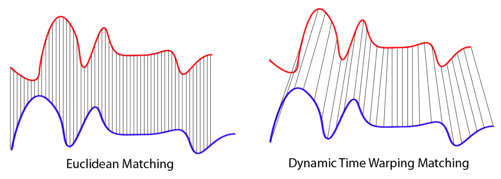

# Dynamic Time Warping による時系列クラスタリング

時間がずれている時系列データの類似度を周期や動きを基準に判断する手法

 

Workshop では階層型クラスタリングが実装されているという理由から dtaidistance を利用していますが、他にも Dynamic Time Warping が実装されているライブラリは多数あります。(下記参照)  


## ライブラリのインストール
利用する分析環境毎にライブラリをインストールします。

### Azure Databricks 
Databricks 環境へのインストール手順は
[Install a library on a cluster](https://docs.azuredatabricks.net/user-guide/libraries.html#install-a-library-on-a-cluster) を参照

### Azure Machine Learning service
Python 環境に pip でライブラリをインストールします。

 ```shell
 pip install dtaidistance
 ```

## Dynamic Time Warping ライブラリ
- Python Library
    - [dtaidistance](https://pypi.org/project/dtaidistance/#description)
    - [fastdtw](https://github.com/slaypni/fastdtw)
    - [dtw](https://github.com/pierre-rouanet/dtw)
    - [tslearn](https://github.com/rtavenar/tslearn)
    - [ucrdtw](http://www.cs.ucr.edu/~eamonn/SIGKDD_trillion.pdf)   
- R Library  
    - [dtw](http://dtw.r-forge.r-project.org/)